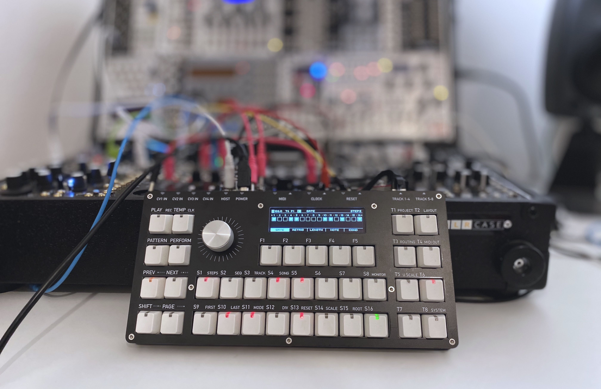

# PER|FORMER

## unofficial standalone version

## overview

This repository contains the [DipTrace](https://diptrace.com) hardware design files for the modified standalone Westlicht PER|FORMER.

It is in no way related to the work of the [original developer](https://github.com/westlicht) of the PER|FORMER, whose official version can be found [here](https://github.com/westlicht/performer-hardware).

The (currently) needed custom firmware can be found in a [branch from my fork](https://github.com/modularev/performer/tree/mechanical-matrix-mod) of the [performer software](https://github.com/westlicht/performer).

## hardware issues in v0.1

take a look at the issues [here]().

## license

Like the original version, this work is licensed under a [Creative Commons Attribution-NonCommercial-ShareAlike 4.0 International License](http://creativecommons.org/licenses/by-nc-sa/4.0/).

 

